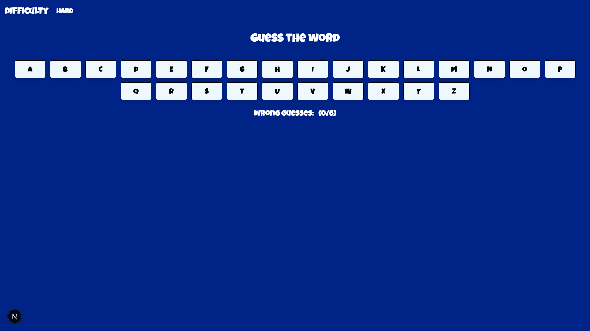
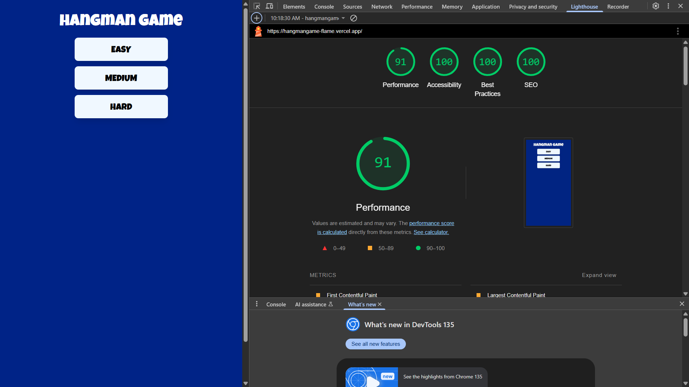

# The hangman

Ho sviluppato un minigame divertente ispirandomi al gioco dell'impiccato. L'utente in base alla difficoltà, deve indovinare la parola digitando sulla tastiera generata sotto la parola. Nota che dal PC si può usare direttamente la tastiera reale

**Tecnologie utilizzate:**
- NextJS
- ReactJS
- Tailwind
- Random Word API
- Javascript
- Zustand
- Axios
- Tanstack
- Framer motion

# Valutazione delle performance

